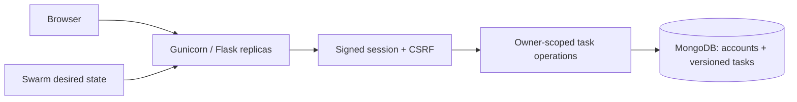

# Cloud Task Manager

A containerized task workspace exploring the engineering behind a small web service: authenticated accounts, concurrent edits, database persistence, and rolling deployments.

[](https://github.com/Suhail15/Cloud-Task-Manager/actions/workflows/checks.yml)

**Python · Flask · MongoDB · Gunicorn · Docker Compose · Docker Swarm**

## What it demonstrates

| Concern | Implementation |
|---|---|
| Account security | Scrypt password hashes, unique normalized usernames, expiring signed sessions, CSRF checks on every form mutation |
| Data isolation | Every task query and mutation includes the authenticated account ID |
| Concurrent edits | Atomic compare-and-set updates use a task version; stale edits return HTTP 409 |
| Usability | Responsive interface, priorities, completion filters, task counts, and bounded pagination |
| Operations | Separate process liveness and database readiness endpoints; JSON request logs with generated request IDs |
| Deployment | Non-root container, persistent MongoDB volume, three web replicas and rolling-update rollback policy in the Swarm example |
| Verification | The same application tests run against an in-memory MongoDB substitute and a real MongoDB service in CI |

For example, two browser tabs can both open task version 1. After the first completes it, the second tab cannot silently overwrite that change: its outdated version is rejected, and the page asks the user to reload.



## Run locally

Requires Docker with Compose. From the repository root:

```bash
python3 -c "import secrets; print('SECRET_KEY='+secrets.token_hex(32))" > .env
docker compose up --build -d
```

Open [localhost:8081](http://localhost:8081), create an account, and add tasks. Keep `.env` private. The web port binds only to localhost; MongoDB has no published host port. Subsequent starts reuse the same data and session secret. Generate `.env` once, rather than replacing it on every start.

```bash
curl http://localhost:8081/health/live
curl http://localhost:8081/health/ready
docker compose logs web
docker compose down
```

Stopping the stack keeps the database volume. No startup script deletes data, kills unrelated processes, or resets an existing Swarm.

## Run the tests

Use Python 3.11:

```bash
python3 -m venv .venv
source .venv/bin/activate
pip install -r requirements-dev.txt
python -m pytest -q
```

The default tests use `mongomock`; this does not substitute for database integration testing. To test a real local MongoDB server, set `TEST_MONGO_URI=mongodb://localhost:27017` before running pytest. Tests use a random `test_...` database and remove only that database afterward.

Tests cover registration, password verification, CSRF, session rotation, cross-account access, stale updates and deletes, escaping, pagination, input validation, database failures, and sessions shared across app instances.

CI also starts the Compose deployment and runs `python tests/smoke_http.py`, exercising registration through logout over real HTTP. This creates a test account, so run it against a disposable deployment. Local validation passed 17 application tests against both database backends, built the container, and exercised the deployed HTTP flow.

## Single-node Swarm lab

This is a separate deployment from Compose. Stop the Compose web service first to free port 8081. These commands assume a disposable local Docker environment; Swarm's published port is not restricted to localhost.

```bash
docker compose down
docker swarm init
docker build -t cloud-task-manager:local .
set -a
source .env
set +a
docker stack deploy -c stack.yaml taskboard
docker service ls
docker service ps taskboard_web
docker service scale taskboard_web=4
```

The web service starts three replicas. All replicas use the same session secret and MongoDB. Build a new image tag to exercise rolling updates:

```bash
docker build -t cloud-task-manager:v2 .
docker service update --image cloud-task-manager:v2 taskboard_web
docker service rollback taskboard_web
```

The update policy replaces one replica at a time and requests automatic rollback on update failure. The Docker health check observes process liveness; `/health/ready` separately reports database availability. This prevents a shared database outage from making every web replica appear to have a dead process.

## Scope and tradeoffs

This project began as an individual UQ INFS3208 container orchestration assignment and was extended into a portfolio service. The task domain stays intentionally small so concurrency, isolation, and deployment behaviour remain inspectable.

- **Single database, not full high availability.** MongoDB is a single instance with a local volume. The Swarm example pins services to manager nodes and is intended for one node; a real cluster needs registry-hosted images, explicit data placement and a replicated database.
- **Local deployment defaults.** Before an internet deployment, add TLS, secure cookies (`COOKIE_SECURE=true`), distributed authentication rate limiting, host validation, database authentication and managed secrets. There is no password recovery or multi-factor authentication.
- **Session revocation.** Signing enables replicas to validate sessions without sticky routing. A stolen cookie remains usable until expiry; logout only clears the browser copy. Server-side session revocation is a future extension.
- **No performance claim.** Replica configuration is not a throughput benchmark. CI validates application behaviour and image construction; it does not run a multi-node failure experiment.
- Existing username-only demo data is not imported: accounts now have stable IDs and passwords.

Design references: [Flask security guidance](https://flask.palletsprojects.com/en/stable/web-security/) and [MongoDB single-document atomicity](https://www.mongodb.com/docs/manual/core/write-operations-atomicity/).

Built by [Mohammed Suhail Hussain](https://github.com/Suhail15). No software license has been selected.
